# TaskPilot – Task Management API

This is a FastAPI-based Task Management API designed with user authentication, role-based authorization, and full CRUD functionality for tasks. The project includes a working deployment on Railway, interactive Swagger documentation, and a demonstration (via screenshots) of the complete request flow: creating a task, retrieving it, updating it, deleting it, and showing permission restrictions.

Below is the full documentation referencing each screenshot stored in the `images/` folder.

---

## 🚀 Deployment Status

### **Railway Deployment Active**

The API is deployed successfully on Railway and is active and running.
**Screenshot:** `images/01_railway_deployed.png`

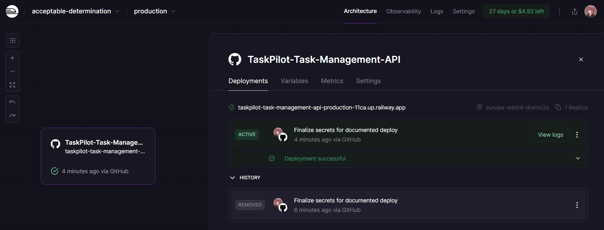

---

## 🔐 Environment Variables

### **SECRET_KEY Configured**

Inside Railway, the environment variable **SECRET_KEY** is correctly set.
**Screenshot:** `images/02_env_secret_key.png`

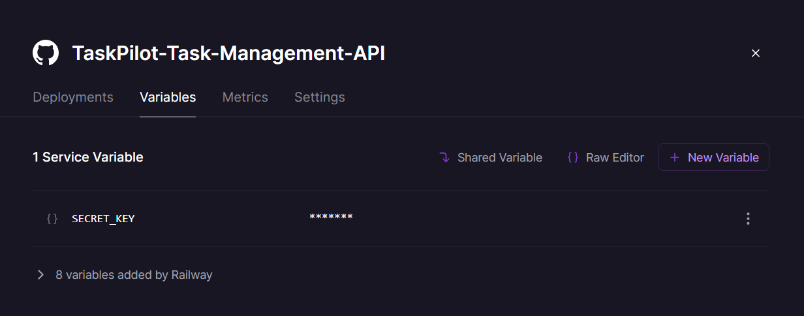

---

## 📘 Swagger UI Overview

Swagger UI shows all available endpoints for both **Tasks** and **Users**, along with utility endpoints like health checks.
**Screenshot:** `images/03_swagger_endpoints.png`

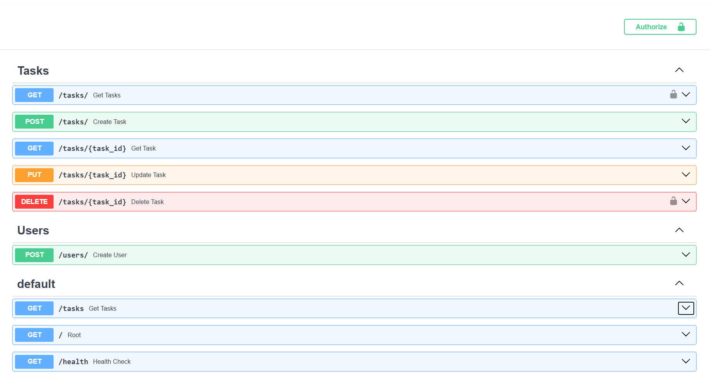

---

## 🟦 Creating a Task (POST /tasks)

### 1. **Editing JSON Body for Task Creation**

Body used in Swagger UI:

* **title:** "Doing Coursework"
* **description:** "Finish writing report for the subject DSA"
  **Screenshot:** `images/04_swagger_post_body.png`

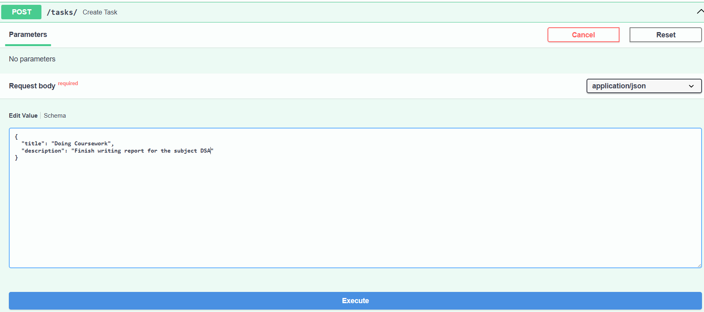

### 2. **Task Successfully Created (200 OK)**

Railway logs confirm a successful POST.
**Screenshot:** `images/05_railway_post_200.png`

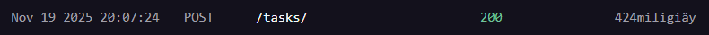

### 3. **Response in Swagger**

The API returns:

* id = 1
* completed = false
* title + description
  **Screenshot:** `images/06_swagger_post_response.png`

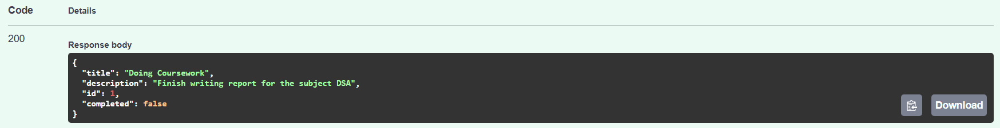

---

## 🟩 Retrieving Task by ID (GET /tasks/1)

### 1. **Entering Task ID in Swagger**

**Screenshot:** `images/07_swagger_get_id_input.png`

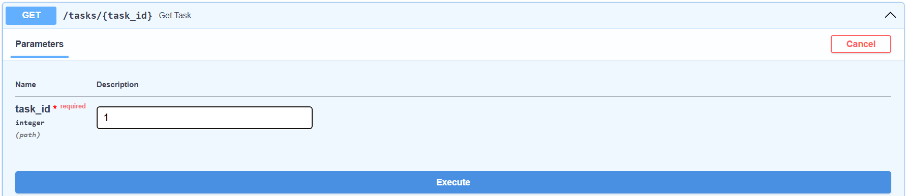

### 2. **Successful 200 Response**

**Screenshot:** `images/08_swagger_get_id_200.png`

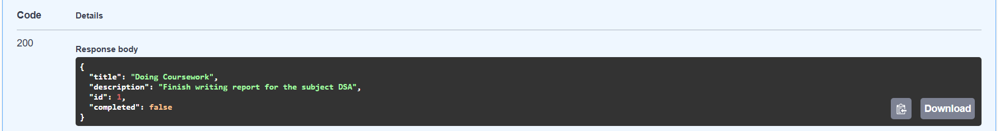

### 3. **Railway Logs Confirm 200**

**Screenshot:** `images/09_railway_get_id_200.png`

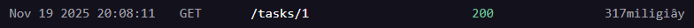

---

## 🟧 Updating a Task (PUT /tasks/1)

### 1. **Editing Updated Body**

New description + marking task completed:

* completed = true
  **Screenshot:** `images/10_swagger_put_body.png`

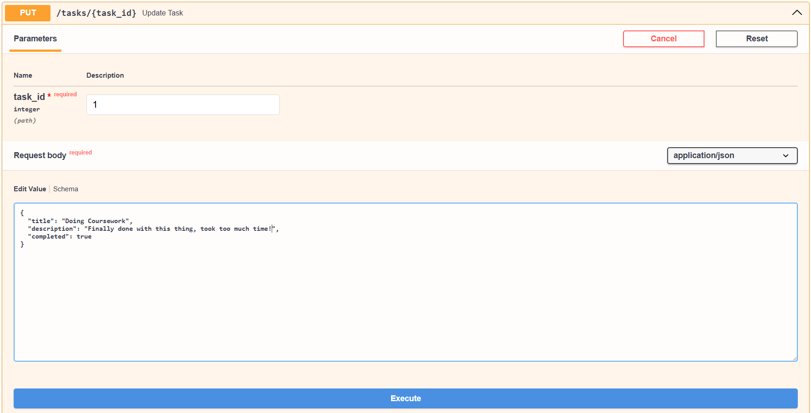

### 2. **Updated Successfully (200)**

**Screenshot:** `images/11_swagger_put_response.png`

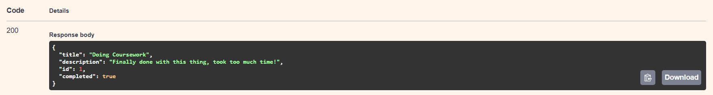

### 3. **Railway Logs Confirm 200**

**Screenshot:** `images/12_railway_put_200.png`

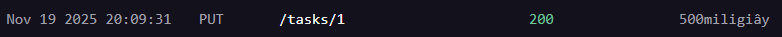

---

## 🟥 Deleting a Task (DELETE /tasks/1)

### 1. **Attempting Delete with No Auth**

User enters task_id = 1.
**Screenshot:** `images/13_swagger_delete_input.png`

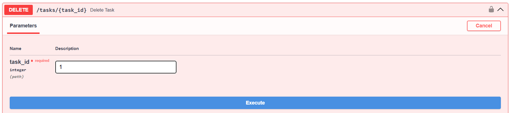

### 2. **401 Unauthorized Error in Swagger**

Because delete requires an admin.
**Screenshot:** `images/14_swagger_delete_401.png`

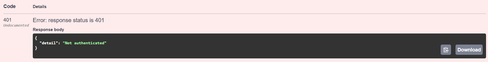

### 3. **Railway Logs Also Show 401**

**Screenshot:** `images/15_railway_delete_401.png`

---

## 🔒 Why DELETE Requires Admin – Backend Code Screenshots

### **Delete Endpoint Showing `require_role("admin")`**

The `delete_task` route depends on `require_role("admin")`.
**Screenshot:** `images/16_delete_code_role_required.png`

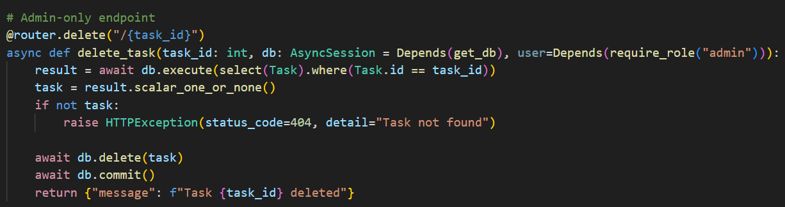

### **Security Flow in Code**

`require_role` → depends on `get_current_user` → depends on OAuth2PasswordBearer.
**Screenshot:** `images/17_require_role_flow.png`

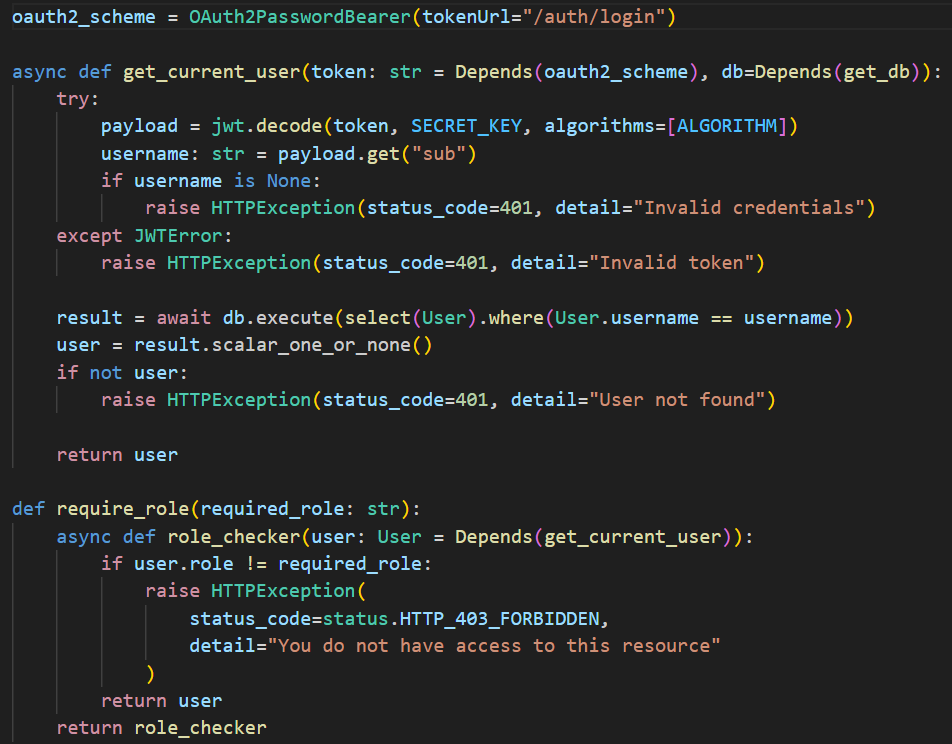

---

## 🧑‍💻 Creating a User (POST /users)

### 1. **Posting a New User in Swagger**

Example body:

* username: `HAHA_I_AM_HACKER`
* email: `hacker@example.com`
* password: `hehehe_boi`
* role: `admin`
  **Screenshot:** `images/18_swagger_post_user.png`

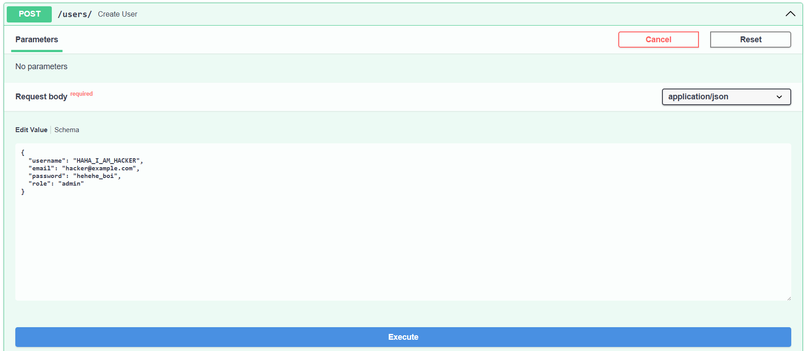

### 2. **Successful 200 Response**

**Screenshot:** `images/19_swagger_user_200.png`

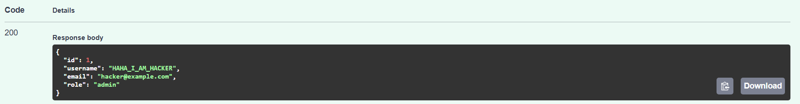

### ⚠️ Security Note

The user creation route does **not** require authentication and depends only on `get_db`, creating a security risk.
**Screenshot:** `images/20_user_creation_code_risk.png`

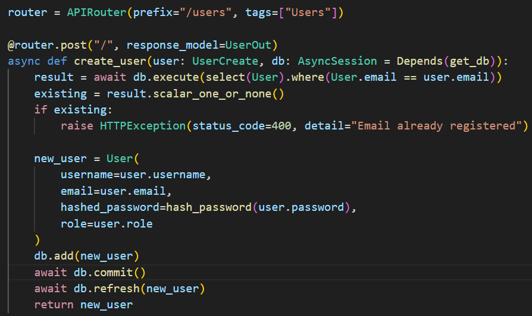

---

## 📦 Features

### ✔️ FastAPI Backend

### ✔️ OAuth2 Password Authentication

### ✔️ Role-Based Authorization (Admin-Only Delete)

### ✔️ CRUD Operations for Tasks

### ✔️ User Creation Endpoint

### ✔️ Deployment on Railway

### ✔️ Swagger UI Interactive Docs

---

## 🛠️ Tech Stack

* Python / FastAPI
* SQLAlchemy ORM
* PostgreSQL (Railway)
* OAuth2 with Password Flow
* Pydantic Models
* Uvicorn

